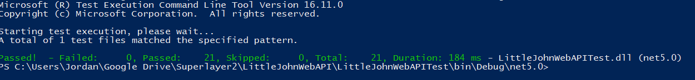

# LittleJohnWebAPI

LittleJohnWebAPI is a sample ASP Net Core 5.0 Web API project.

# Run
In order to run the project, you need to start _IdentityServer.exe_, which manages access token generation and validation, and _LittleJohnWebAPI.exe_, which manages the broker API.

Both executables are required to be running in order to access the APIs.

# Test
You can run unit tests by compiling the solution and running 

```dotnet test  <local-repository-path>LittleJohnWebAPI\LittleJohnWebAPITest\bin\Debug\net5.0\LittleJohnWebAPI.dll```

You will get the following result:

