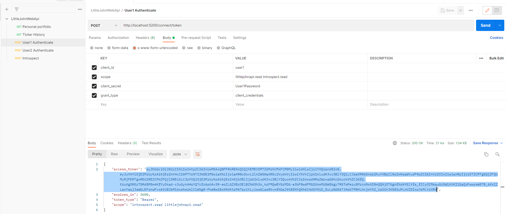

# LittleJohn

LittleJohn is a sample ASP Net Core 5.0 Web API project which mocks an online broker where users hold a portfolio of stocks.

# Run the application
LittleJohn is made of two components: 
* _IdentityServer_, which manages access token generation and validation
*  _LittleJohnWebAPI_, which manages the broker API.

Both of these components need to be running in order to access the required APIs.

## First approach: docker-compose
You can launch both components by using _docker-compose_ (requires [Docker](https://www.docker.com/) installed on your machine). It will take care of building and runnig both components.

First of all clone the repository, then open a terminal in the root of the local repository (where the _docker-compose.yml_ file is located). Then launch:

```docker-compose up```

## Second approach: contained executables
If for some reason you don't want to use _docker-compose_, you can launch the application by downloading and unzipping the _LittleJohnWebApi package.zip_ provided in the root of this repository. Then you need to launch the two executables:
* _IdentityServer/Identity.exe_
* _LittleJohnWebApi/LittleJohnWebAPI.exe_

You should not need to install anything in order to run the executables, as they have been published in a self-contained manner.

# Test the application
No matter what approach you chose to launch the project, _IdentityServer_ can be reached at http://localhost:5200 and  _LittleJohnWebAPI_ at http://localhost:5100.

You can test the application using the Postman collection _LittleJohnWebApi.postman_collection.json_ provided in the root of this repository. 


Import the collection in Postman. You will see the following requests:


A couple of users, _user1_ and _user2_, have been set up as demo users. First of all you need to retrieve an Access Token using the _User Authenticate_ API:



Then you need to copy the access token you just acquired and you can use it to access the _Personal portfolio_ and _Ticker History_ APIs.

Copy it into the _username_ field in the _Authorization_ tab of a request, while leaving the _password_ filed empty.


The _Introspect_ API is only useful for testing Access Token validity.

# Automated tests
Unit tests have been written using the arrange-assert-act pattern. [Nunit](https://nunit.org/), [FakeItEasy](https://fakeiteasy.github.io/) and [FluentAssertions](https://fluentassertions.com/) have been used to write the tests.

In order to compile the solution and execute the tests you need to install [.NET 5.0 SDK](https://dotnet.microsoft.com/download/dotnet/5.0).

First you need to compile the solution:

```dotnet build LittleJohnWebAPI.sln --configuration Debug```

Then you can execute the tests with the following command:

```dotnet test  <local-repository-path>LittleJohnWebAPI\LittleJohnWebAPITest\bin\Debug\net5.0\LittleJohnWebAPI.dll```

You will get the following result, with (hopefully :wink:) all tests passed:


# Final note
The solution has been implemented exposing the APIs only on HTTP. Of course that implementation is only for testing purposes. Setting up certificates for HTTPS would be required in a real production environment.