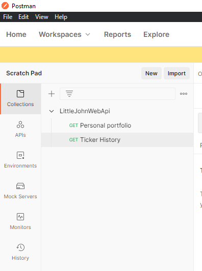
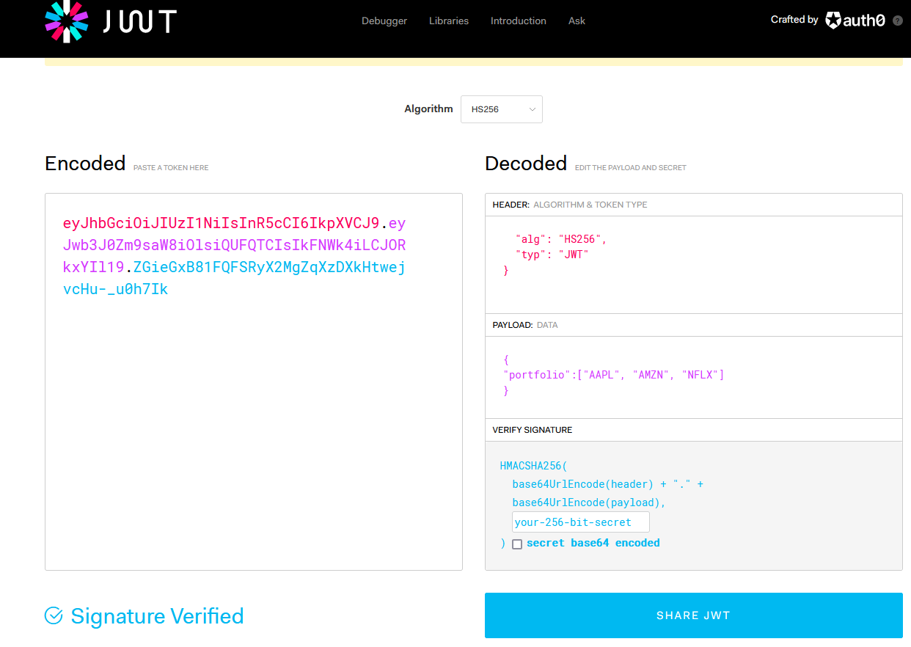
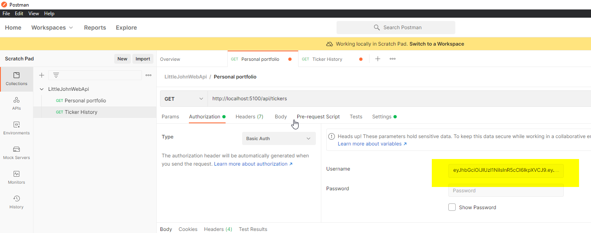

# LittleJohn

LittleJohn is a sample ASP Net Core 5.0 Web API project which mocks an online broker where users hold a portfolio of stocks.

# Run the application
LittleJohn is made of _LittleJohnWebAPI.exe_, which is the server side component that manages the broker API.

This component requires to be running in order to access the API.

## First approach: docker run
You can launch both components by using _docker build_ and _docker run_ (requires [Docker](https://www.docker.com/) installed on your machine). It will take care of building and running the server.

First of all clone the repository, then open a terminal in the _LittleJohnWebAPI_ folder (where the Dockerfile_ is located). Then launch:

```
docker build -t little-john-web-api .
docker run -p 50051:50051 little-john-web-api
```

## Second approach: contained executables
If for some reason you don't want to use Docker commands, you can launch the application by downloading and unzipping the _LittleJohnWebApi package.zip_ provided in the root of this repository. Then you need to launch the executable _LittleJohnWebApi/LittleJohnWebAPI.exe_

You should not need to install anything in order to run the executables, as they have been published in a self-contained manner.

# Test the application
No matter what approach you chose to launch the project  _LittleJohnWebAPI_ can be reached at http://localhost:5100.

You can test the application using the Postman collection _LittleJohnWebApi.postman_collection.json_ provided in the root of this repository. 


Import the collection in Postman. You will see the following requests:



## Generate access token
For testing purposes, you need to generate a JWT access token (for example, on https://jwt.io/).
The token needs to have the following structure:



In particular, the token needs to be in JWT format (xxxxx.yyyyy.zzzzz). In addition, it is required to specify in the payload "portfolio" field the list of tickers associated to the user for which you are requesting the token.
You need to specify a minimum of 1 to a maximum of 10 tickers.

## Invoke the API

You can use the generated access token it to access the _Personal portfolio_ and _Ticker History_ APIs.

Copy it into the _username_ field in the _Authorization_ tab of a request, while leaving the _password_ field empty.



# Automated tests
Unit tests have been written using the arrange-assert-act pattern. [Nunit](https://nunit.org/), [FakeItEasy](https://fakeiteasy.github.io/) and [FluentAssertions](https://fluentassertions.com/) have been used to write the tests.

In order to compile the solution and execute the tests you need to install [.NET 5.0 SDK](https://dotnet.microsoft.com/download/dotnet/5.0).

First you need to compile the solution:

```dotnet build LittleJohnWebAPI.sln --configuration Debug```

Then you can execute the tests with the following command:

```dotnet test  <local-repository-path>LittleJohnWebAPI\LittleJohnWebAPITest\bin\Debug\net5.0\LittleJohnWebAPI.dll```

You will get the following result, with (hopefully :wink:) all tests passed:


# Final note
The solution has been implemented exposing the APIs only on HTTP. Of course that implementation is only for testing purposes. Setting up certificates for HTTPS would be required in a real production environment.